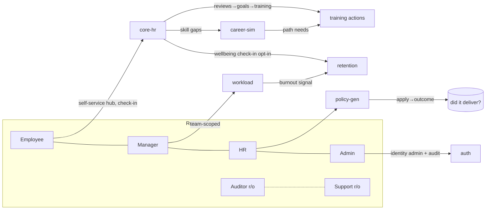

# SmartHR360 — Case Study

An HR analytics platform built as **7 Django/DRF microservices + a Next.js 16 frontend**,
designed to look and behave like real enterprise software: JWT RS256 auth, a six-role
RBAC with separation of duties, per-service databases, cross-service integration,
observability, and a full test + CI story.

**Live demo:** see `DEMO.md` for the URL and the read-only **guest** login.
**Deep architecture:** `ARCHITECTURE.md`. **Security posture:** `SECURITY_REVIEW.md`.

---

## The problem it models

Most HR tools are five disconnected dashboards. SmartHR360's thesis is that HR data is
only useful when it **closes the loop**: data → insight → *action* → *measured outcome*.
Every analytics module ends in a tracked action with a real result, and the modules feed
each other instead of sitting in silos.

## Architecture at a glance

Seven services, each owning its own PostgreSQL database (no shared DB, no cross-service
foreign keys — identity flows by value through signed JWT claims):

| Service | Owns | Signature capability |
|---|---|---|
| **auth** | identity, roles, sessions | RS256 JWT + JWKS rotation, 2FA, GDPR erasure, audit trail |
| **core-hr** | employees, skills, reviews, docs, wellbeing, notifications | EAI/ERP ingest, SCD2 history, HR-Open interop, skill-gap ML, global search |
| **workload** | tasks, workload scores | burnout forecast → pushes a signal to retention |
| **retention** | attrition signals, conversations | attrition prediction, cost-of-attrition ROI, proactive chatbot |
| **career-sim** | target roles, competencies | trajectory comparison, internal mobility, succession planning |
| **policy-gen** | HR policy simulations | A/B policy compare, apply → **measured outcome** dashboard |
| **future-skills** | skill-demand ML | RandomForest predictions (async), drift monitoring, dataset upload |

Cross-cutting concerns (JWT auth, metrics, pagination, SCD2 history, inter-service
clients) live in **shared vendored packages** — written once, never copied.

## What makes it feel like a product, not a demo

- **Six-role RBAC with separation of duties.** EMPLOYEE / MANAGER / HR / ADMIN, plus
  read-only AUDITOR & SUPPORT (modeled as JWT groups). Identity administration is
  **ADMIN-only**; HR owns people data but can't assign roles. Managers are **row-level
  scoped** to their direct team. Every role has a real home (employees land on a personal
  hub; admins get an audit trail).
- **The loop-closers.** Retention shows € cost-of-attrition vs realized savings; policy
  simulations are *applied* then their real turnover/cost outcome is recorded and
  aggregated ("did this policy actually deliver?"); skill gaps and career paths become
  tracked training actions.
- **Modules that talk.** Workload burnout → retention; opt-in wellbeing check-in →
  retention (while anonymous surveys stay anonymous — a deliberate privacy boundary);
  reviews → goals → training; a unified **Action Center** aggregates everything waiting
  on you; global ⌘K search spans people/skills/org.

## Engineering practices

- **Testing:** per-service Django suites (unit + integration against real Postgres) and
  a Playwright E2E suite covering RBAC, scoping, and every feature flow.
- **CI:** GitHub Actions runs the shared-package tests, validates compose, boots the
  whole stack from source and runs every service's suite + an integration smoke test,
  plus gitleaks secret scanning; the frontend CI gates on `next build` (typecheck).
- **Observability:** custom Prometheus business metrics with gunicorn multiprocess
  aggregation, Grafana dashboards, Alertmanager rules.
- **Ops:** hardened non-root Docker images, RS256 key rotation, django-axes lockouts,
  HSTS/secure headers, one-command cloud deploy behind Caddy (automatic HTTPS) with a
  seeded read-only public demo.

## By the numbers

- 7 backend microservices + shared packages + Next.js frontend
- 6 roles with server-enforced authorization and row-level scoping
- Full E2E + per-service backend test suites, gated in CI
- Data→insight→action→outcome implemented end-to-end in 5 analytics modules

---

*Built iteratively with a strict rule: audit what exists before adding, never duplicate
a data owner, and verify every change against a real Postgres before calling it done.*
